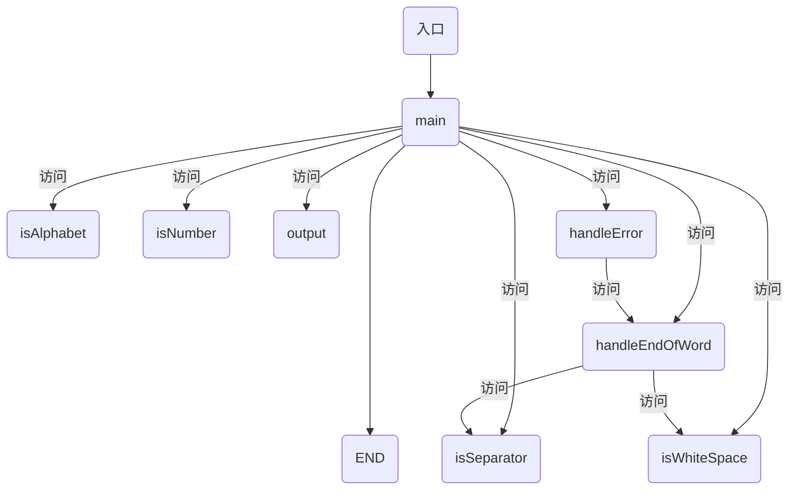

# 编译原理实验报告
王子龙 18281218 wangzilong@bjtu.edu.cn
## 实验环境
类目 | 详情
:-: | :-:
操作系统 | macOS Big Sur 11.2.3
CPU | Intel Core i5-7260U@2.3Ghz x2
IDE | CLion 2020.3.3 Build #CL-203.7717.62
Compiler | Apple clang version 11.0.0 (clang-1100.0.33.8)
## 实验要求
### 实验项目
以下为正则文法所描述的C语言子集单词符号的示例，请补充单词符号： ++，--， >>,  <<, += , -= ,\*=, /= ，&&（逻辑与），||（逻辑或），！（逻辑非）等等，给出补充后描述C语言子集单词符号的正则文法，设计并实现其词法分析程序。
<标识符>→字母︱ <标识符>字母︱ <标识符>数字
<无符号整数>→数字︱ <无符号整数>数字
<单字符分界符> →+ ︱－ ︱\* ︱；︱, ︱(︱) ︱{︱}
<双字符分界符>→<大于>=︱<小于>=︱<小于>>︱<感叹号>=︱<等于>=︱<斜竖>\*    <小于>→<      <等于>→=      <大于>→>      <斜竖> →/
<感叹号>→!
该语言的保留字 ：void、int、float、double、if、else、for、do、while 等等（也可补充）。   

### 设计说明
- 可将该语言设计成大小写不敏感，也可设计成大小写敏感，用户定义的标识符最长不超过32个字符；
- 字母为a-z A-Z，数字为0-9；
- 可以对上述文法进行扩充和改造；（4）“/*……*/”和“//”(一行内)为程序的注释部分。
### 设计要求
- 给出各单词符号的类别编码；
- 词法分析程序应能发现输入串中的错误；
- 词法分析作为单独一遍编写，词法分析结果为二元式序列组成的中间文件；（4）设计两个测试用例（尽可能完备），并给出测试结果。
## 实验内容
### 文件列表
文件 | 说明
:-: | :-:
main.cpp | 程序入口
Classification.h / Classification.cpp | 判断字符是否为字母、数字、空格（回车等）或分隔符的函数
Handler.h / Handler.cpp | 错误处理或结尾处理
Output.h / Output.cpp | 文件输出
### 文件功能介绍
#### Classification.cpp
**Classification.cpp**共包含了四个字符类型判断相关的函数，返回值均为bool型：
##### isAplhabet
函数isAlphabet通过输入字符与字母边界的ASCII码比较判断，其具体实现如下：

```C++
bool isAlphabet(char ch) {
    return ((ch >= 'a' && ch <= 'z') || (ch >= 'A' && ch <= 'Z'));
}
```
##### isNumber
函数isNumber通过输入字符与数字边界的ASCII码比较判断，其具体实现如下：
```C++
bool isNumber(char ch) {
    return (ch >= '0' && ch <= '9');
}
```
##### isWhiteSpace
函数isWhiteSpace通过直接匹配进行判断，其具体实现如下：
```C++
bool isWhiteSpace(char ch) {
    return (ch == ' ' || ch == '\n' || ch == '\t' || ch == '\r');
}
```
##### isSeparator
函数isSeparator通过直接匹配来判断分隔符，其具体实现如下：
```C++
bool isSeparator(char ch) {
    return (ch == ';' || ch == ',' || ch == '(' || ch == ')' || ch == '{' || ch == '}');
}
```
#### Handler.cpp
**Handler.cpp**包含了进行打印或错误处理的相关函数：
##### handleError
函数handleError是若程序判断到输入错误后，程序直接读取到下一分隔符并打印，其具体实现如下：
```C++
void handleError() {
    char ch;
    do {
        ifile >> ch;
    } while (!isWhiteSpace(ch));
    output("error");
}
```
##### handleEndOfWord
函数handleEndOfWord是若程序判断输入正确，读取到下一分隔符后打印，其具体实现如下：
```C++
void handleEndOfWord(string str) {
    char ch;
    ifile >> ch;
    // 正确结束
    if (isWhiteSpace(ch) || isSeparator(ch)){
        output(str);
    }
        // 错误结束
    else {
        handleError();
    };
    ifile.seekg(-1, ios::cur);  // 文件指针回退
}
```
#### Output.cpp
**Output.cpp**包含了一个STL中map的数据结构以及一个文件输出相关函数:

##### map
此map具体实现如下：
```C++
std::map<std::string, std::string> IDofWords;
```
map的key值为标识符，value对应为其值。
##### output
函数output包含两个参数
参数 | 说明
:-: | :-:
type | 标识符类型
item | 标识符的值
其具体实现如下：
```C++
void output(string type, string item = "") {
    if (type == "error") {
        ofile << "error" << endl;
        cout << "error" << endl;
    }
    else if (type == "integer") {
        ofile << "[" + IDofWords[type] + ", " + item + "]" << endl;
        cout << "[" + IDofWords[type] + ", " + item + "]" << endl;
    }
    else if (type == "identifier") {
        // 判断是否为保留字
        if (IDofWords.count(item) == 1) {
            ofile << "[" + IDofWords[item] + ", " + item + "]" << endl;
            cout << "[" + IDofWords[item] + ", " + item + "]" << endl;
        }
        else {
            ofile << "[" + IDofWords[type] + ", " + item + "]" << endl;
            cout << "[" + IDofWords[type] + ", " + item + "]" << endl;
        }
    }
    else {
        ofile << "[" + IDofWords[type] + ", " + type + "]" << endl;
        cout << "[" + IDofWords[type] + ", " + type + "]" << endl;
    }
}
```
#### main.cpp
在**main.cpp**中，首先声明了两个全局变量，分别为std::ifstream类型的ifile，用作文件读入以及std::ofstream类型的ofile用于输出文件写入。
随后进入主函数，在主函数中首先声明一个字符（character）型变量ch用于存放当前读入字符，同时将ifile通过`ifile >> noskipws;`设置为允许读空格。随后若文件不能打开，则直接退出程序：
```C++
if (!ifile.is_open()) {
    cout << "Failed to open file." << endl;
    return 0;
}
```
若文件正常打开，则一直读取知道文件结尾，即`!ifile.eof()`。随后进行分支判断：
```C++
while (!ifile.eof()) {
    ifile >> ch;
    string token(1, ch);  // 将当前字符装入字符串
    switch (ch) {
        // 纯单字符分界符
        case '{': case '}': case '(': case ')': case ',': case ';':
            output(token);
            break;
            // 单、双字符分解符 + - < >
        case '+': case '-': case '<': case '>':
            ifile >> ch;
            if (isWhiteSpace(ch)) {
                output(token);
            }
            else if (ch == '=' || ch == token[0] || (token[0] == '<' && ch == '>')) {
                token = token.append(1, ch);
                handleEndOfWord(token);
            }
            else {
                handleError();
            }
            break;
            // 单、双字符分解符 * / ! =
        case '*': case '/': case '!': case '=':
            ifile >> ch;
            if (isWhiteSpace(ch)) {
                output(token);
            }
            else if (token[0] == '/' && ch == '/') {
                char temp[255];
                ifile.getline(temp, 255);
            }
            else if (token[0] == '/' && ch == '*') {
                bool isWellEnded = false;  // 注释是否正确结束
                while (!ifile.eof()) {
                    ifile >> ch;
                    if (ch == '*') {
                        ifile >> ch;
                        if (ch == '/') {
                            isWellEnded = true;
                            break;
                        }
                        else {
                            ifile.seekg(-1, ios::cur);
                        }
                    }
                }
                if (!isWellEnded) output("error");
            }
            else if (ch == '=') {
                token = token.append(1, ch);
                handleEndOfWord(token);
            }
            else {
                handleError();
            }
            break;
            // 单、双字符分解符 & |
        case '&': case '|':
            ifile >> ch;
            if (isWhiteSpace(ch)) {
                output(token);
            }
            else if (ch == token[0]) {
                token = token.append(1, ch);
                handleEndOfWord(token);
            }
            else {
                handleError();
            }
            break;
            // 空
            case ' ': case '\n': case '\t': case '\r':
            break;
        default:
            // 整数
            if (isNumber(ch)) {
                token = "";
                do {
                    token += ch;
                    ifile >> ch;
                } while (isNumber(ch));
                // 正确结束
                if (isWhiteSpace(ch) || isSeparator(ch)) {
                    output("integer", token);
                }
                    // 错误结束
                else {
                    do {
                        ifile >> ch;
                    } while (!isWhiteSpace(ch));
                    output("error");
                };
                ifile.seekg(-1, ios::cur);
            }
                // 标识符
            else if (isAlphabet(ch)) {
                token = "";
                int length = 0;
                do {
                    token += ch;
                    length++;
                    ifile >> ch;
                } while (isAlphabet(ch) || isNumber(ch));
                // 正确结束
                if ((isWhiteSpace(ch) || isSeparator(ch)) && length <= 32) {
                    output("identifier", token);
                }
                    // 错误结束
                else {
                    do {
                        ifile >> ch;
                    } while (!isWhiteSpace(ch));
                    output("error");
                };
                ifile.seekg(-1, ios::cur);
            }
                // 啥都不是
            else {
                output("error");
            }
    }
}
```
最后关闭文件，退出程序：
```C++
ifile.close();
ofile.close();
```
### 函数调用关系

### 主要数据结构描述
使用了map存储了ID与word之间的对应关系。
## 测试结果
### 测试用例1
```C
//111
/*222*/
void main() {
    int sum = 0;
    for(int i = 0; i <= 10; i++) {
        sum += i << 2;
        sum += i >> 2;
        sum += 2;
        sum *= 2;
        sum /= 2;
        sum -= 2;
     if (sum == 63 && i < 5 || sum == 128)
          break;
     i!=3;
    }

    return 0;
}
```
### 测试结果1
```
[34, void]
[44, main]
[15, (]
[16, )]
[17, {]
[35, int]
[01, sum]
[12, =]
[02, 0]
[13, ;]
[40, for]
[15, (]
[35, int]
[01, i]
[12, =]
[02, 0]
[13, ;]
[01, i]
[20, <=]
[02, 10]
[13, ;]
error
[17, {]
[01, sum]
[28, +=]
[01, i]
[27, <<]
[02, 2]
[13, ;]
[01, sum]
[28, +=]
[01, i]
[26, >>]
[02, 2]
[13, ;]
[01, sum]
[28, +=]
[02, 2]
[13, ;]
[01, sum]
[30, *=]
[02, 2]
[13, ;]
[01, sum]
[31, /=]
[02, 2]
[13, ;]
[01, sum]
[29, -=]
[02, 2]
[13, ;]
[38, if]
[15, (]
[01, sum]
[23, ==]
[02, 63]
[32, &&]
[01, i]
[09, <]
[02, 5]
[33, ||]
[01, sum]
[23, ==]
[02, 128]
[16, )]
[01, break]
[13, ;]
error
[18, }]
[43, return]
[02, 0]
[13, ;]
[18, }]
[18, }]
```
### 测试用例2
```C
int main() {
    int a = 3;
    int b = 666;
    while (a > 0) {
        a--;
        b -= 3;        
    }

    return 0;
}
```
### 测试结果2
```
[35, int]
[44, main]
[15, (]
[16, )]
[17, {]
[35, int]
[01, a]
[12, =]
[02, 3]
[13, ;]
[35, int]
[01, b]
[12, =]
[02, 666]
[13, ;]
[42, while]
[15, (]
[01, a]
[08, >]
[02, 0]
[16, )]
[17, {]
error
[01, b]
[29, -=]
[02, 3]
[13, ;]
[18, }]
[43, return]
[02, 0]
[13, ;]
[18, }]
```
## 附录
### map内容
```C++
std::map<std::string, std::string> IDofWords = {
        {"identifier", "01"},
        {"integer", "02"},
        {"+", "03"},
        {"-", "04"},
        {"*", "05"},
        {"/", "06"},
        {"!", "07"},
        {">", "08"},
        {"<", "09"},
        {"&", "10"},
        {"|", "11"},
        {"=", "12"},
        {";", "13"},
        {",", "14"},
        {"(", "15"},
        {")", "16"},
        {"{", "17"},
        {"}", "18"},
        {">=", "19"},
        {"<=", "20"},
        {"<>", "21"},
        {"!=", "22"},
        {"==", "23"},
        {"++", "24"},
        {"--", "25"},
        {">>", "26"},
        {"<<", "27"},
        {"+=", "28"},
        {"-=", "29"},
        {"*=", "30"},
        {"/=", "31"},
        {"&&", "32"},
        {"||", "33"},
        {"void", "34"},
        {"int", "35"},
        {"float", "36"},
        {"double", "37"},
        {"if", "38"},
        {"else", "39"},
        {"for", "40"},
        {"do", "41"},
        {"while", "42"},
        {"return", "43"},
        {"main", "44"}
};
```
### main.cpp
```C++
#include <bits/stdc++.h>
#include "Classification.h"
#include "Handler.h"
#include "Output.h"

using namespace std;

ifstream ifile("sample1.c");
ofstream ofile("output.txt");

int main() {
    char ch;  // 存放当前字符
    ifile >> noskipws;  // 允许读空格

    if (!ifile.is_open()) {
        cout << "Failed to open file." << endl;
        return 0;
    }
    while (!ifile.eof()) {
        ifile >> ch;
        string token(1, ch);  // 将当前字符装入字符串

        switch (ch) {

            // 纯单字符分界符
            case '{': case '}': case '(': case ')': case ',': case ';':
                output(token);
                break;

                // 单、双字符分解符 + - < >
            case '+': case '-': case '<': case '>':
                ifile >> ch;
                if (isWhiteSpace(ch)) {
                    output(token);
                }
                else if (ch == '=' || ch == token[0] || (token[0] == '<' && ch == '>')) {
                    token = token.append(1, ch);
                    handleEndOfWord(token);
                }
                else {
                    handleError();
                }
                break;

                // 单、双字符分解符 * / ! =
            case '*': case '/': case '!': case '=':
                ifile >> ch;
                if (isWhiteSpace(ch)) {
                    output(token);
                }
                else if (token[0] == '/' && ch == '/') {
                    char temp[255];
                    ifile.getline(temp, 255);
                }
                else if (token[0] == '/' && ch == '*') {
                    bool isWellEnded = false;  // 注释是否正确结束
                    while (!ifile.eof()) {
                        ifile >> ch;
                        if (ch == '*') {
                            ifile >> ch;
                            if (ch == '/') {
                                isWellEnded = true;
                                break;
                            }
                            else {
                                ifile.seekg(-1, ios::cur);
                            }
                        }
                    }
                    if (!isWellEnded) output("error");
                }
                else if (ch == '=') {
                    token = token.append(1, ch);
                    handleEndOfWord(token);
                }
                else {
                    handleError();
                }
                break;

                // 单、双字符分解符 & |
            case '&': case '|':
                ifile >> ch;
                if (isWhiteSpace(ch)) {
                    output(token);
                }
                else if (ch == token[0]) {
                    token = token.append(1, ch);
                    handleEndOfWord(token);
                }
                else {
                    handleError();
                }
                break;

                // 空
                case ' ': case '\n': case '\t': case '\r':
                break;

            default:

                // 整数
                if (isNumber(ch)) {
                    token = "";
                    do {
                        token += ch;
                        ifile >> ch;
                    } while (isNumber(ch));
                    // 正确结束
                    if (isWhiteSpace(ch) || isSeparator(ch)) {
                        output("integer", token);
                    }
                        // 错误结束
                    else {
                        do {
                            ifile >> ch;
                        } while (!isWhiteSpace(ch));
                        output("error");
                    };
                    ifile.seekg(-1, ios::cur);
                }

                    // 标识符
                else if (isAlphabet(ch)) {
                    token = "";
                    int length = 0;
                    do {
                        token += ch;
                        length++;
                        ifile >> ch;
                    } while (isAlphabet(ch) || isNumber(ch));
                    // 正确结束
                    if ((isWhiteSpace(ch) || isSeparator(ch)) && length <= 32) {
                        output("identifier", token);
                    }
                        // 错误结束
                    else {
                        do {
                            ifile >> ch;
                        } while (!isWhiteSpace(ch));
                        output("error");
                    };
                    ifile.seekg(-1, ios::cur);
                }

                    // 啥都不是
                else {
                    output("error");
                }
        }
    }
    ifile.close();
    ofile.close();

    return 0;
}
```
### Classification.h
```C++
//
// Created by 王子龙 on 2021/4/22.
//

#ifndef CODE_CLASSIFICATION_H
#define CODE_CLASSIFICATION_H

bool isAlphabet(char ch);
bool isNumber(char ch);
bool isWhiteSpace(char ch);
bool isSeparator(char ch);

#endif //CODE_CLASSIFICATION_H
```
### Classification.cpp
```C++
//
// Created by 王子龙 on 2021/4/22.
//

bool isAlphabet(char ch) {
    return ((ch >= 'a' && ch <= 'z') || (ch >= 'A' && ch <= 'Z'));
}

bool isNumber(char ch) {
    return (ch >= '0' && ch <= '9');
}

bool isWhiteSpace(char ch) {
    return (ch == ' ' || ch == '\n' || ch == '\t' || ch == '\r');
}

bool isSeparator(char ch) {
    return (ch == ';' || ch == ',' || ch == '(' || ch == ')' || ch == '{' || ch == '}');
}
```
### Handler.h
```C++
//
// Created by 王子龙 on 2021/4/22.
//

#ifndef CODE_HANDLER_H
#define CODE_HANDLER_H

void handleError();
void handleEndOfWord(std::string str);

#endif //CODE_HANDLER_H
```
### Handler.cpp
```C++
//
// Created by 王子龙 on 2021/4/22.
//
#include <fstream>
#include <string>
#include "Classification.h"
#include "Output.h"

using namespace std;
extern ifstream ifile;
extern ofstream ofile;

// 错误处理 读到不是空格的地方
void handleError() {
    char ch;
    do {
        ifile >> ch;
    } while (!isWhiteSpace(ch));
    output("error");
}

// 正确结束则打印 错误结束则错误处理
void handleEndOfWord(string str) {
    char ch;
    ifile >> ch;
    // 正确结束
    if (isWhiteSpace(ch) || isSeparator(ch)){
        output(str);
    }
        // 错误结束
    else {
        handleError();
    };
    ifile.seekg(-1, ios::cur);  // 文件指针回退
}
```
### Output.h
```C++
//
// Created by 王子龙 on 2021/4/22.
//

#ifndef CODE_OUTPUT_H
#define CODE_OUTPUT_H

void output(std::string type, std::string item = "");

#endif //CODE_OUTPUT_H
```
### Output.cpp
```C++
//
// Created by 王子龙 on 2021/4/22.
//
#include <bits/stdc++.h>

using namespace std;

extern ifstream ifile;
extern ofstream ofile;

std::map<std::string, std::string> IDofWords = {
        {"identifier", "01"},
        {"integer", "02"},
        {"+", "03"},
        {"-", "04"},
        {"*", "05"},
        {"/", "06"},
        {"!", "07"},
        {">", "08"},
        {"<", "09"},
        {"&", "10"},
        {"|", "11"},
        {"=", "12"},
        {";", "13"},
        {",", "14"},
        {"(", "15"},
        {")", "16"},
        {"{", "17"},
        {"}", "18"},
        {">=", "19"},
        {"<=", "20"},
        {"<>", "21"},
        {"!=", "22"},
        {"==", "23"},
        {"++", "24"},
        {"--", "25"},
        {">>", "26"},
        {"<<", "27"},
        {"+=", "28"},
        {"-=", "29"},
        {"*=", "30"},
        {"/=", "31"},
        {"&&", "32"},
        {"||", "33"},
        {"void", "34"},
        {"int", "35"},
        {"float", "36"},
        {"double", "37"},
        {"if", "38"},
        {"else", "39"},
        {"for", "40"},
        {"do", "41"},
        {"while", "42"},
        {"return", "43"},
        {"main", "44"}
};

void output(string type, string item = "") {
    if (type == "error") {
        ofile << "error" << endl;
        cout << "error" << endl;
    }
    else if (type == "integer") {
        ofile << "[" + IDofWords[type] + ", " + item + "]" << endl;
        cout << "[" + IDofWords[type] + ", " + item + "]" << endl;
    }
    else if (type == "identifier") {
        // 判断是否为保留字
        if (IDofWords.count(item) == 1) {
            ofile << "[" + IDofWords[item] + ", " + item + "]" << endl;
            cout << "[" + IDofWords[item] + ", " + item + "]" << endl;
        }
        else {
            ofile << "[" + IDofWords[type] + ", " + item + "]" << endl;
            cout << "[" + IDofWords[type] + ", " + item + "]" << endl;
        }
    }
    else {
        ofile << "[" + IDofWords[type] + ", " + type + "]" << endl;
        cout << "[" + IDofWords[type] + ", " + type + "]" << endl;
    }
}
```