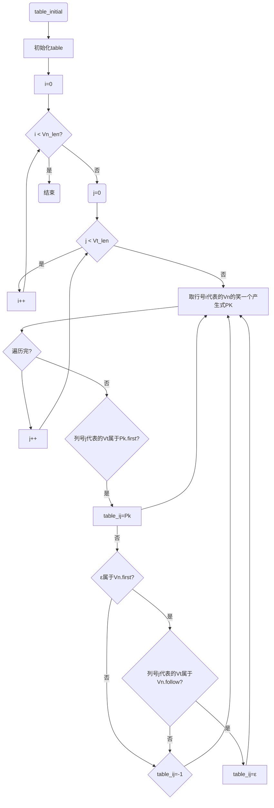

# 编译原理实验报告
王子龙 18281218 wangzilong@bjtu.edu.cn
## 实验环境
类目 | 详情
:-: | ---
操作系统 | macOS Big Sur 11.3.1 
CPU | Intel Core i5-7260U@2.3Ghz x2
IDE | CLion 2021.1.2 Build #CL-211.7442.42
Compiler | Apple clang version 11.0.0 (clang-1100.0.33.8)
## 实验要求（实验功能描述）
### 实验项目
实现LL(1)分析中控制程序（表驱动程序）；完成以下描述赋值语句的LL(1)文法的LL(1)分析过程。
$$
\begin{equation*}
	\begin{aligned}
		G[S]: & S \rightarrow V=E\\
					& E \rightarrow TE′\\
          & E′ \rightarrow ATE′|ε\\
          & T \rightarrow FT′\\
          & T′ \rightarrow MFT′|ε\\
          & F \rightarrow (E)|i\\
          & A \rightarrow +|-\\
          & M \rightarrow *|/\\
          & V \rightarrow i\\
  \end{aligned}
\end{equation*}
$$
### 设计说明
终结符号`i`为用户定义的简单变量，	即标识符的定义。
### 设计要求
- 输入串应是词法分析的输出二元式序列，即某算术表达式“专题1”的输出结果。输出为输入串是否为该文法定义的算术表达式的判断结果；
- LL(1)分析过程应能发现输入串出错；
- 设计两个测试用例（尽可能完备，正确和出错），并给出测试结果；
- 考虑根据LL(1)文法编写程序构造LL（1）分析表，并添加到你的LL（1）分析程序中。
## 主要数据结构描述
### 文法结构体`GLO`
```C++
typedef struct Glo
{
    VN *VNs;
    VN *VTs;
} GLO;
```
其中`VNs`为非终结符号数组，` VTs`为终结符号数组，定义`VN`类型如下:
### 符号数组
```C++
typedef struct vn
{
    string Key;
    int Seq;
    int *Funcs;
    int *first;	//以-1为结束标志
    int *follow; //以-1为结束标志
} VN;
```
每个`VN`类型变量包含一个`String`类型的`Key`，存储其具体名称，一个编号`Seq`，非终结符号还有对应的产生式指针`Func`，其中存储对应产生式的编号。以及`First`集和`Follow`集指针，其中存储的为终结符号的编号。

本实验中的`VNs`和`VTs`定义如下（其中“0”表示空产生式）：
```C++
VN vns[] = {{"E", 1}, {"E'", 2}, {"T", 3}, {"T'", 4}, {"F", 5}, {"A", 6}, {"M", 7}};
VN vts[] = {{"(", 8}, {")", 9}, {"/", 10}, {"i", 11}, {"*", 12}, {"-", 13}, {"#", 14}, {"+", 15}, {"0", 16}};
```
每个产生式右部的数据结构定义如下：
```C++
typedef struct func
{
    string Keys;
    int *Seqs;
} FUNC;
```
其中`Keys`为产生式右部的具体字符串表示，`Seq`为组成一个产生式所有终结与非终结符号的编号数组。如对于产生式右部“TE’”，存储它的`FUNC`类型变量的`Keys =“TE’”`，`Seqs = [3, 2, 0]`(T，E’的编号分别为3, 2, 0为结束标志)。全部右部的具体初始化定义如下:
```C++
FUNC func[] = {{"TE'"}, {"ATE'"}, {"FT'"}, {"MFT'"}, {"(E)"}, {"+"}, {"-"}, {"i"}, {"*"}, {"/"}, {"0"}};

//每个导出式右部的序号数组,以0为一个右部的结束标志,如TE' 为3，2，0, 里面的数字对应vns和vnt中的序号
int func_seq[][10] = {{3, 2, 0}, {6, 3, 2, 0}, {5, 4, 0}, {7, 5, 4, 0}, {8, 1, 9, 0}, {15, 0}, {13, 0}, {11, 0}, {12, 0}, {10, 0}, {16, 0}};
```
因为一个非终结符号可以导出多个产生式右部，故要对每个产生式右部编号，让`VN`结构体中的`Funcs`数组存储每个非终结结符号对应的所有右部编号。按照 E,E’...的顺序，分别对应的产生式右部编号为(0为结束标志):
```C++
//每个非终结符号包含的所有导出式的序号， 里面的数字对应func_seq中的数组序号，如 1 对应func[0], 2 对应func[1]
int func_vn[][10] = {{1, 0}, {2, 11, 0}, {3, 0}, {4, 11, 0}, {5, 8, 0}, {6, 7, 0}, {9, 10, 0}};
```
如E’对应ATE’和空产生式，分别在`FUNC`中的位置为第2个和第11个，故为{2,11, 0}。
## 程序结构描述
### First set & Follow set的自动求解
通过递归的方法，按照求first集的准则，定义`find_first`函数。其形参为`VN`类型变量。通过一次函数调用，求出作为形参的`vn`的所有first集成员。
```C++
void find_first(VN vn)
{
    if (vn.first[0] > 0)
    {
        return;
    }
    int vt_len = sizeof(vts) / sizeof(vts[0]);
    int vn_len = sizeof(vns) / sizeof(vns[0]);

    int first_index = 0;			  //填充first集
    int func_index = 0;				  //func_index遍历非终结符号的产生式
    while (vn.Funcs[func_index] != 0) //vn.Funcs[func_index]为对应的产生式右部序号
    {
        int key = vn.Funcs[func_index];

        if (key == 11)
        {
            vn.first[first_index] = 16; //填充空产生式编号
            first_index++;
        }

        else if (head_is_final(func[key - 1])) //func[key - 1]为具体的一个产生式右部
        {
            vn.first[first_index] = func[key - 1].Seqs[0]; //func[key - 1].Seq[0]为产生式右部第一个符号的编号
            first_index++;
        }
        else
        {
            VN first_vn = vns[func[key - 1].Seqs[0] - 1];
            find_first(first_vn);
            int copy_index = 0;
            while (first_vn.first[copy_index] != -1)
            {
                vn.first[first_index] = first_vn.first[copy_index];
                first_index++;
                copy_index++;
            }
        }
        func_index++;
    }
    vn.first[first_index] = -1;
}
```
而对于follow集，则按照两步流程，将所有`vn`的follow集求出，即第一次遍历所有非终结符号实现书中“构造FOLLOW集算法”的准则 2:
对于每一${A}\rightarrow\alpha{B}\beta\in{P}$，令$FISRT(\beta)-\{\epsilon\}\subseteq{FOLLOW(B)}$ 
第二次遍历所有非终结符号实现准则3:
对于每一$A\rightarrow\alpha{B}\in{P}$或$A\rightarrow\alpha{B}\beta\in{P}$，且$\epsilon\in{FIRST(B)}$，则令$FOLLOW(A)\subseteq{FOLLOW(B)}$
其函数为`void find_follow()`

```C++
void find_follow()
{

    int vn_len = sizeof(vns) / sizeof(vns[0]);
    for (int i = 0; i < vn_len; i++)
    {
        vns[i].follow[0] = 14;
    }

    //第一次循环 实现A -> aBb， first(b) - 空 属于follow(B)
    for (int vn_index = 0; vn_index < vn_len; vn_index++)
    {
        int func_index = 0;							 //func_index遍历非终结符号的产生式
        while (vns[vn_index].Funcs[func_index] != 0) //(vn_index + 1)才是当前产生式左部的编号
        {
            int f = vns[vn_index].Funcs[func_index];	//对应func_seq元素的编号, 即一个具体的产生式右部的编号
            int func_len = 1;							//记录一个产生式右部的长度, 包括结束标志0
            while (func[f - 1].Seqs[func_len - 1] != 0) //func[f - 1].Seqs是一个产生式右部符号的编号数组，
            {											//E -> TE'即 （vn_index + 1）-> { 3, 2, 0}
                func_len++;
            }
            for (int i = func_len - 2; i > 0; i--) //一个产生式右部每相邻的两个非终结符号，follow（before）包含first（after）
            {
                int before = func[f - 1].Seqs[i - 1];
                int after = func[f - 1].Seqs[i];
                if (v_is_final(before) && v_is_final(after))
                {
                    continue;
                }
                else if (!v_is_final(before) && v_is_final(after))
                {
                    cat_follow(vns[before - 1].follow, after);
                }
                else if (!v_is_final(before) && !v_is_final(after))
                {
                    cat_follow(vns[before - 1].follow, vns[after - 1].first);
                }
                else
                {
                    continue;
                }
            }

            func_index++;
        }
    }

    //第二次循环 实现A -> aB 或 A -> aBb, 空属于first（b)， follow(A)属于follow(B)
    for (int vn_index = 0; vn_index < vn_len; vn_index++)
    {
        int func_index = 0;							 //func_index遍历非终结符号的产生式
        while (vns[vn_index].Funcs[func_index] != 0) //(vn_index + 1)才是当前产生式左部的编号， vn_index是数组索引
        {
            int f = vns[vn_index].Funcs[func_index];	//对应func_seq元素的编号, 即一个具体的产生式右部的编号
            int func_len = 1;							//记录一个产生式右部的长度, 包括结束标志0
            while (func[f - 1].Seqs[func_len - 1] != 0) //func[f - 1].Seqs是一个产生式右部符号的编号数组，
            {											//E -> TE'即 （vn_index + 1）-> { 3, 2, 0}
                func_len++;
            }
            //A -> aB,follow(A)属于follow(B)
            int end = func[f - 1].Seqs[func_len - 2];
            if (v_is_final(end) == false)
            {
                if (end != 16)
                    cat_follow(vns[end - 1].follow, vns[vn_index].follow); // 如E -> TE' follow(E)属于follow(E')
            }
            for (int i = func_len - 2; i > 0; i--)
            {
                int before = func[f - 1].Seqs[i - 1];
                int after = func[f - 1].Seqs[i];
                if (!v_is_final(after) && !v_is_final(before))
                {
                    if (first_has_null(vns[after - 1].first))
                    {
                        //A -> aBb, 空属于first（b)， follow(A)属于follow(B)
                        cat_follow(vns[before - 1].follow, vns[vn_index].follow);
                    }
                }
            }
            func_index++;
        }
    }
}
```
通过两个函数便可以将每个非终结符号的first集和follow集求出。
```
E.first: 
(  i  
E.follow: 
#  )  
E'.first: 
+  -  0  
E'.follow: 
#  )  
T.first: 
(  i  
T.follow: 
#  +  -  )  
T'.first: 
*  /  0  
T'.follow: 
#  +  -  )  
F.first: 
(  i  
F.follow: 
#  *  /  +  -  )  
A.first: 
+  -  
A.follow: 
#  (  i  
M.first: 
*  /  
M.follow: 
#  (  i  
```
### LL(1)表自动生成
LL(1)表自动生成的思路即简历一个二维数组`table`，行索引表示非终结符号的编号，列索引表示终结符号的编号，数组元素$table[V_n][V_t]$表示非终结符号$V_n$对应$V_t$时应采取的动作（即产生式）的编号，若无相应动作则置为$-1$。
算法具体流程图如图所示：

### LL(1)分析法
定义 LL1 分析器为`vector`变量，初始化时将“#”和开始符号推入分析容器，同时取出输入字符串的首元素，接下来反复执行以下步骤：
设在分析的某一时刻，分析容器和余留输入串为如下格局:
#X<sub>1</sub>X<sub>2</sub>X<sub>3</sub>...X<sub>m-1</sub>X<sub>m</sub> | a<sub>i</sub>a<sub>i+1</sub>...a<sub>n</sub>#
:-: | :-:
此时，可视分析容器顶部的文法符号$X_m$的不同情况，分别作如下的处理：
- 若$X_m\in V_T\cup \{\#\}$，且$X_m=a_i$，则表明容器顶符号已与当前正扫视的输入符号相匹配，此时应将$X_m$从容器中退出，并将输入串指示器向前推进一个位置，否则按错误处理。
- 若$X_m\in V_N$，则以符号对$table(X_m,a_i)$进行检查，设$table(X_m,a_i)$代表的产生式为$X_m\rightarrow{Y_1Y_2Y_3...Y_K}$，则将$X_m$从容器中退出，将$X_m\rightarrow{Y_1Y_2Y_3...Y_K}$按反序推入容器。得到如下格局:
#X<sub>1</sub>X<sub>2</sub>X<sub>3</sub>...X<sub>m-1</sub>Y<sub>K</sub>Y<sub>K-1</sub>...Y<sub>1</sub> | a<sub>i</sub>a<sub>i+1</sub>...a<sub>n</sub>#
:-: | :-:
若$table(X_m,a_i)=-1$，按出错处理。
## 程序测试
#### 测试样例1
$$
i+i-i
$$
**INPUT:**
$(11,"i")$
$(15,"+")$
$(11,"i")$
$(13,"-")$
$(11,"i")$
运行结果如下：

```
# E 
# E' T 
# E' T' F 
# E' T' i 
# E' T' 
# E' 
# E' T A 
# E' T + 
# E' T 
# E' T' F 
# E' T' i 
# E' T' 
# E' 
# E' T A 
# E' T - 
# E' T 
# E' T' F 
# E' T' i 
# E' T' 
# E' 
# 
```
可以根据结果写成推导式
$$
\begin{equation*}
\begin{aligned}
E &\rightarrow{TE'}\rightarrow{TATE'}\\
  &\rightarrow{TATATE'}\rightarrow{TATAT}\\
  &\rightarrow{TATAi}\rightarrow{TAT-i}\\
  &\rightarrow{TAFT'-i}\rightarrow{TAF-i}\\
  &\rightarrow{TAi-i}\rightarrow{T+i-i}\\
  &\rightarrow{FT'+i-i}\rightarrow{F+i-i}\\
  &\rightarrow{i+i-i}
\end{aligned}
\end{equation*}
$$
#### 测试样例2
$$
i+iii
$$
**INPUT:**
$(11,"i")$
$(15,"+")$
$(11,"i")$
$(11,"i")$
$(11,"i")$
运行结果如下：

```
# E 
# E' T 
# E' T' F 
# E' T' i 
# E' T' 
# E' 
# E' T A 
# E' T + 
# E' T 
# E' T' F 
# E' T' i 
# E' T' 
匹配错误
```
可见在匹配完第一个$i$和第一个$+$之后，无法继续匹配成功。


